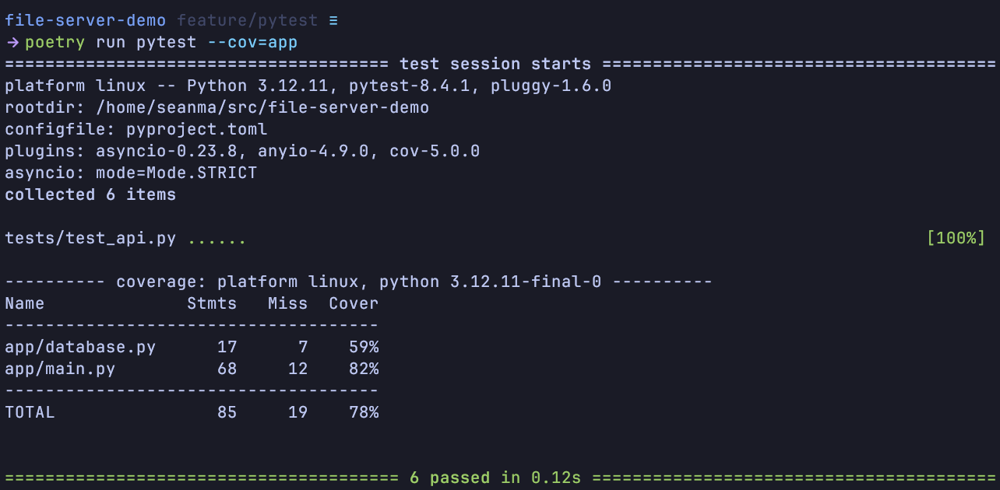

# File Server Demo


## Clone & Setup
```bash
git clone https://github.com/seanmamasde/fileserver-demo.git
cd fileserver-demo

# create virtualenv (any tool is fine)
python -m venv .venv && source .venv/bin/activate

# install deps
pip install poetry
poetry install
```

## Local Containers

```bash
# build and bring up fullstack (api + db)
docker compose up --build

# follow logs
docker compose logs -f
```

## CLI Usages

```bash
# default server = http://localhost:8000

echo "hello world" > hello.txt # or any file you want

./filesrv-cli upload ./hello.txt
./filesrv-cli list
./filesrv-cli download hello.txt -o ./downloads/
./filesrv-cli delete hello.txt
./filesrv-cli ping
```

## Tests

```bash
# to run tests
poetry run pytest --cov=app
```



## Pre-commit

```bash
# to install pre-commit
pre-commit install 

# installing pre-push
pre-commit install -t pre-push

# running it
# this will take sometime for the first run, cus it needs to initialize environment for various tools. Subsequent runs should be much faster.
pre-commit run --all-files
```
